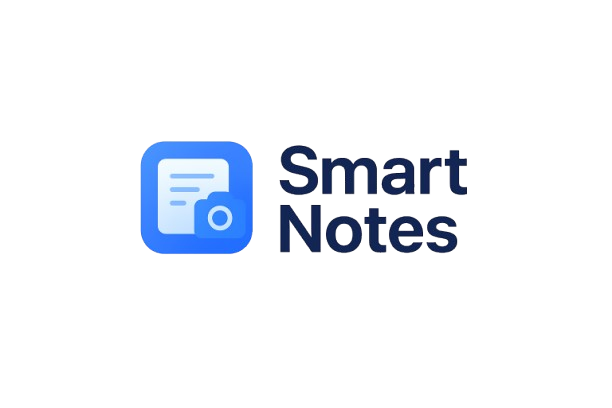

<div align="center">
  
  <h1>Smart Notes App 🧠 - Capture, Scan & Organize Your Ideas</h1>


</div>

---

## 🧩 Project Overview

**Smart Notes App** is an AI-powered productivity tool designed to make note-taking smarter, faster, and more intuitive.  
With **OCR (Optical Character Recognition)** powered by **Google ML Kit**, you can scan handwritten or printed text directly into your digital notebook.  
Organize, categorize, and manage all your thoughts, ideas, and tasks seamlessly — all within one app.

---

## 🚀 Features

- 📝 **Create & Edit Notes** – Add rich-text notes with titles and categories.  
- 📷 **OCR Text Extraction** – Convert images into editable text using Google ML Kit.  
- 📂 **Smart Organization** – Categorize notes into Personal, Work, or Ideas.  
- 🔍 **Search Functionality** – Instantly find any note by keyword.  
- ☁️ **Cloud Sync** – Save and sync notes using Firebase.  
- 🖼️ **Image Attachments** – Add and preview images within notes.  
- 🌙 **Dark/Light Mode** – Beautiful and adaptive interface.  

---

## 🧠 Technology Stack

### Frontend
- **Framework:** Flutter (Dart)
- **UI Design:** Figma ([View Design](https://www.figma.com/design/6uk6fJPOqjI9f9N4mK3hfz/Smart-Notes-App--Zeeshan-Ahmad-?node-id=0-1))

### Backend
- **Firebase Authentication** – Secure login & signup  
- **Firebase Firestore** – Real-time cloud database  
- **Firebase Storage** – For images and note backups  
- **Google ML Kit** – OCR for text recognition  

---

## ⚙️ Installation

### Prerequisites
- Flutter SDK (v3.0+)
- Android Studio or VS Code
- Firebase Project setup
- Google ML Kit dependencies

### Setup

1. **Clone the repository:**
   ```bash
   git clone https://github.com/Zeeshier/Smart-Notes-App.git
   cd Smart-Notes-App
   ```

2. **Install dependencies:**
   ```bash
   flutter pub get
   ```

3. **Connect Firebase:**
   - Add your google-services.json file to /android/app/.
   - Enable Firestore, Authentication, and Storage in your Firebase Console.
---

## 📂 Project Structure
```
Smart-Notes-App/
├── assets/                # App icons, images, and fonts
├── lib/
│   ├── main.dart          # App entry point
│   ├── screens/           # All UI screens
│   │   ├── splash_screen.dart
│   │   ├── login_screen.dart
│   │   ├── signup_screen.dart
│   │   ├── home_screen.dart
│   │   ├── add_note_screen.dart
│   │   ├── note_detail_screen.dart
│   │   ├── edit_note_screen.dart
│   │   ├── ocr_scan_screen.dart
│   │   └── ocr_result_screen.dart
│   ├── models/            # Note, user, etc.
│   ├── services/          # Firebase & ML Kit services
│   ├── widgets/           # Reusable components
│   └── utils/             # Helpers and constants
├── android/               # Android build files
├── ios/                   # iOS build files
├── pubspec.yaml           # Dependencies
├── README.md              # Documentation
└── LICENSE
```
---
## 🧩 Core Modules
1. **OCR Text Extraction**
   - Integrates Google ML Kit to extract text from images.
   - Converts scanned text into editable note content.

2. **Cloud Sync with Firebase**
   - Saves notes, images, and user data securely.
   - Supports real-time sync across devices.

3. **Smart Categorization**
   - Organizes notes into Work, Personal, and Ideas.
   - Enables easy filtering and quick search.
   
---

### 📊 UI Overview

| Screen           | Description                                   |
| ---------------- | --------------------------------------------- |
| **Splash**       | App logo animation                            |
| **Onboarding**   | Intro slides explaining features              |
| **Login/Signup** | Firebase Authentication integration           |
| **Home**         | Notes list, search bar, and category tabs     |
| **Add Note**     | Create note with image or text                |
| **Note Detail**  | Full note view with edit/delete/share options |
| **Edit Note**    | Modify and save existing note                 |
| **OCR Scan**     | Live camera for text extraction               |
| **OCR Result**   | Preview and save extracted text               |
| **Settings**     | Dark mode toggle and user profile management  |

---
## 🧱 Figma Design
- 🎨 Designed in Figma by Zeeshan Ahmad.
- It follows a soft blue theme — modern, minimal, and productivity-oriented.

---

## 📈 Future Enhancements
- 🤖 AI-based Note Summarization (using Gemini / OpenAI API)
- 📅 Calendar Integration for time-bound notes
- 🗣️ Voice-to-Text Notes for quick input
- 🧩 Offline Mode with local storage support
---

## 📜 License

This project is licensed under the MIT License — see the LICENSE file for details.

---

## 💬 Acknowledgments

- Google ML Kit for OCR
- Firebase for backend integration
- Flutter Dev Community for open-source plugins
- **Mentor**: Ms. Tanzila Kehkashan

---
